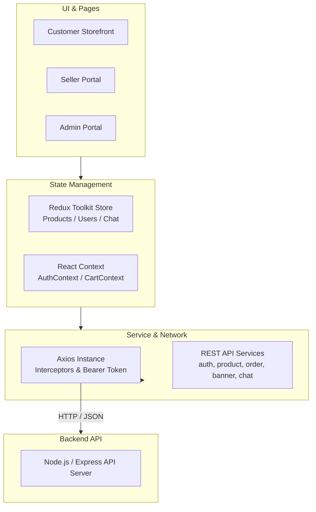

<div align="center">

# 📱 MobiMarket Frontend

**A modern, blazing-fast e-commerce marketplace for buying, selling, and managing verified mobile devices & flagships.**

[](https://react.dev/)
[](https://vitejs.dev/)
[](https://tailwindcss.com/)
[](https://redux-toolkit.js.org/)
[](https://reactrouter.com/)
[](https://zod.dev/)

<br />

[Explore Features](#-key-features) • [Tech Stack](#-tech-stack) • [Project Structure](#-project-structure) • [Routes & Portals](#-routes--portals) • [Getting Started](#-getting-started) • [Environment Setup](#-environment-variables)

</div>

---

## 📖 Overview

**MobiMarket** is a full-featured, enterprise-grade e-commerce frontend tailored for smartphones and electronics. Built with **React 19**, **Tailwind CSS v4**, and **Redux Toolkit**, it provides high-performance client rendering, instant responsive UI, and dedicated multi-role portals for **Customers**, **Sellers**, and **Administrators**.

### ✨ Highlights
- ⚡ **Lightning Fast**: Powered by Vite 6 & React 19 for instantaneous Hot Module Replacement (HMR) and optimized production bundles.
- 🎨 **Tailwind CSS v4 Engine**: Modern styling system leveraging the latest Tailwind v4 compiler for sleek, responsive, and accessible UI.
- 🛡️ **Role-Based Access Control (RBAC)**: Secure multi-tier authentication with segregated routing for Customers, Sellers, and Admins.
- 🛒 **Rich Shopping Experience**: Interactive cart drawer, multi-attribute phone filters (Brand, RAM, Storage, Price), dynamic hero banners, and one-click checkout.
- 💬 **Live Messaging**: Direct buyer-to-seller negotiation chat.
- 📋 **Robust Form Validation**: Typesafe schemas with **Zod** and **React Hook Form** with real-time feedback.

---

## 🚀 Key Features

### 🛍️ 1. Customer Storefront
- **Hero Promotional Banner Carousel**: Dynamic multi-slide promotional carousel with auto-advancing slides and link redirection.
- **Product Catalog & Filters**: Multi-attribute filtering (Brand, Storage capacity, RAM, Category, Price range, Sorting).
- **Search & Discovery**: Live global search bar with instant route queries.
- **Product Details View**: Rich specifications breakdown, image viewer, stock indicators, and seller credentials.
- **Slide-out Cart Drawer**: Persistent cart drawer context with live subtotal calculation and quantity manipulation.
- **Seamless Checkout & Orders**: Streamlined checkout workflow with instant order placement, success confirmation, and order history tracking (`/orders`).

### 💼 2. Dedicated Seller Hub (`/seller`)
- **Seller Analytics Dashboard**: Overview of store performance, total inventory count, and active orders.
- **Inventory & Product Management**: Create, edit, and manage mobile listings with full specification controls and stock counters.
- **Brand & Category Management**: Categorize devices for optimized marketplace discovery.
- **Order Management**: Monitor customer purchases and update order statuses in real time.
- **Buyer Chat**: Direct messaging with potential buyers and customer inquiries.

### 🛡️ 3. Administrator Control Center (`/admin`)
- **Comprehensive Admin Overview**: System-level metrics and controls.
- **Global Catalog Management**: Supervise all products, categories, and brand listings across all sellers.
- **Promotional Banner Manager**: Create, edit, activate/deactivate hero carousel promotional campaigns.
- **User & Role Administration**: Manage registered users, role assignments (`customer`, `seller`, `admin`), and account status.
- **Centralized Orders**: View and manage all marketplace transactions.

### 🔐 4. Authentication & Security
- **JWT & Cookie Management**: Secure token persistence using `js-cookie` with automated bearer authentication.
- **Axios Interceptors**: Centralized request/response interceptor pipeline for automatic token injection and graceful 401 error handling.
- **Account Verification Flow**: Email token activation workflow (`/activate/:token`).
- **Password Recovery**: Secure forgot password and reset flows.
- **Protected Layouts**: Route protection ensuring users only access authorized portals.

---

## 🛠️ Tech Stack

| Category | Technologies / Libraries |
| :--- | :--- |
| **Core Framework** | React 19 (`react`, `react-dom`) |
| **Build & Tooling** | Vite 6 (`vite`, `@vitejs/plugin-react`) |
| **Styling & CSS** | Tailwind CSS v4 (`@tailwindcss/vite`, `clsx`, `tailwind-merge`) |
| **Routing** | React Router v7 (`react-router`) |
| **State Management** | Redux Toolkit (`@reduxjs/toolkit`, `react-redux`), React Context API |
| **Form Handling** | React Hook Form (`react-hook-form`), Zod Schema Validation (`zod`, `@hookform/resolvers`) |
| **HTTP Client** | Axios (`axios`) with custom interceptors |
| **UI Feedback & Alerts**| Sonner Toaster (`sonner`), SweetAlert2 (`sweetalert2`) |
| **Icons** | React Icons (`react-icons` - Tabler & Feather sets) |
| **Storage & Cookies** | JS-Cookie (`js-cookie`), LocalStorage |

---

## 📂 Project Structure

```text
Frontend/
├── public/                     # Static public assets
├── src/
│   ├── assets/                 # Global styles and media
│   │   └── globals.css         # Tailwind CSS v4 imports & theme configs
│   ├── common/                 # Global constants & shared options
│   │   └── constants.js        # RAM, Storage, Brands, Category options
│   ├── components/             # Reusable UI component library
│   │   ├── auth/               # LoginForm, RegisterForm, etc.
│   │   ├── chat/               # ChatActiveUser, ChatMessage, ChatUserList
│   │   ├── common/             # Navbar, Footer, CartDrawer, Badge
│   │   ├── dashboard/          # DashboardHeader, DashboardSidebar, DashboardFooter
│   │   ├── form/               # FormInput, FormSelect, FormTextarea, FormAction
│   │   ├── product/            # ProductCard, ProductFilter
│   │   ├── profile/            # ProfileModal
│   │   └── ui/                 # TableHeader, TablePagination, TableSkeleton
│   ├── config/                 # Configurations & Setup
│   │   ├── axios.config.js     # Axios instance & token interceptors
│   │   ├── socket.config.js    # Real-time WebSocket connection handler
│   │   └── store.js            # Redux Toolkit global store
│   ├── context/                # React Context Providers
│   │   ├── AuthContext.jsx     # Authentication state & actions
│   │   ├── CartContext.jsx     # Shopping cart state & actions
│   │   └── providers/          # Root Context Providers (AuthProvider, CartProvider)
│   ├── hooks/                  # Custom React Hooks
│   │   ├── useAuth.js          # Hook for consuming AuthContext
│   │   └── useCart.js          # Hook for consuming CartContext
│   ├── pages/                  # Page Views & Layouts
│   │   ├── admin/              # Admin dashboard, user & order management
│   │   ├── auth/               # Login, Register, Forgot Password, Activation
│   │   ├── banners/            # Banner creation, editing & listings
│   │   ├── brands/             # Brand administration & public brand catalog
│   │   ├── categories/         # Category administration & category views
│   │   ├── chat/               # Real-time messaging page
│   │   ├── checkout/           # Checkout & Order success confirmation
│   │   ├── customer/           # Customer dashboard & order history
│   │   ├── layout/             # RootLayout, UserLayout (Admin/Seller), AuthLayout
│   │   ├── products/           # Product listing, product details, product CRUD
│   │   ├── seller/             # Seller dashboard & seller orders
│   │   ├── AboutPage.jsx       # Project & developer background
│   │   ├── ErrorPage.jsx       # Error handling & 404 views
│   │   └── HomePage.jsx        # Landing page with hero banner & featured phones
│   ├── reducer/                # Redux Slices
│   │   ├── ChatReducer.js      # Chat conversation & active room state
│   │   ├── ProductReducer.js   # Products, categories, and inventory state
│   │   └── UserReducer.js      # User management state
│   ├── router/                 # React Router v7 Modular Route Configs
│   │   ├── adminRouter.jsx     # Admin-only routes (/admin/*)
│   │   ├── authRouter.jsx      # Auth routes (/login, /register, /activate)
│   │   ├── customerRouter.jsx  # Customer routes (/customer/*)
│   │   ├── publicRouter.jsx    # Storefront public routes (/, /products, /chat, etc.)
│   │   ├── sellerRouter.jsx    # Seller-only routes (/seller/*)
│   │   └── RouterConfig.jsx    # Root router orchestration
│   ├── services/               # Centralized API Service Layer
│   │   ├── auth.service.js     # Auth, login, register, activation APIs
│   │   ├── banner.service.js   # Banners CRUD APIs
│   │   ├── brand.service.js    # Brands CRUD APIs
│   │   ├── category.service.js # Categories CRUD APIs
│   │   ├── chat.service.js     # Messaging & conversation APIs
│   │   ├── order.service.js    # Orders & checkout APIs
│   │   └── product.service.js  # Products catalog & management APIs
│   └── main.jsx                # Application root entry point
├── .env.example                # Example environment variables
├── package.json                # Project dependencies & scripts
├── vite.config.js              # Vite configuration with Tailwind v4 & React
└── vercel.json                 # Vercel SPA deployment routing config
```

---

## 🚦 Routes & Portals

<details open>
<summary><b>🌐 Public Storefront Routes</b></summary>

| Path | Layout | Description |
| :--- | :--- | :--- |
| `/` | `RootLayout` | Marketplace Landing page with Banner Slider & Featured Products |
| `/products` | `RootLayout` | Full product catalog with multi-filter sidebar & search |
| `/products/:id` | `RootLayout` | Detailed smartphone specs, pricing, and seller details |
| `/categories` | `RootLayout` | Category directory |
| `/category/:slug` | `RootLayout` | Category-specific product listings |
| `/brands` | `RootLayout` | Public brand catalog |
| `/brand/:slug` | `RootLayout` | Brand-specific mobile listings |
| `/chat` | `RootLayout` | Real-time negotiation & seller messaging |
| `/checkout` | `RootLayout` | Secure order checkout |
| `/checkout/success` | `RootLayout` | Order confirmation & placement success screen |
| `/orders` | `RootLayout` | Customer order history & tracking |
| `/about` | `RootLayout` | Project & developer information |

</details>

<details>
<summary><b>💼 Seller Portal Routes (<code>/seller</code>)</b></summary>

| Path | Layout | Description |
| :--- | :--- | :--- |
| `/seller` | `UserLayout` | Seller Dashboard with sales metrics & analytics |
| `/seller/products` | `UserLayout` | Manage own mobile phone inventory |
| `/seller/products/create` | `UserLayout` | Create new mobile phone listing |
| `/seller/products/:id` | `UserLayout` | Edit existing product listing |
| `/seller/orders` | `UserLayout` | Track and update buyer orders |
| `/seller/brands` | `UserLayout` | Brand catalog management |
| `/seller/categories` | `UserLayout` | Category management |
| `/seller/messages` | `UserLayout` | Seller message inbox |

</details>

<details>
<summary><b>🛡️ Admin Portal Routes (<code>/admin</code>)</b></summary>

| Path | Layout | Description |
| :--- | :--- | :--- |
| `/admin` | `UserLayout` | Admin dashboard overview |
| `/admin/products` | `UserLayout` | Manage all global marketplace products |
| `/admin/categories` | `UserLayout` | Global category management (CRUD) |
| `/admin/brands` | `UserLayout` | Global brand management (CRUD) |
| `/admin/banners` | `UserLayout` | Promotional hero banner management |
| `/admin/users` | `UserLayout` | User account & role administration |
| `/admin/orders` | `UserLayout` | Global marketplace orders overview |
| `/admin/messages` | `UserLayout` | Central message center |

</details>

<details>
<summary><b>🔑 Authentication Routes</b></summary>

| Path | Layout | Description |
| :--- | :--- | :--- |
| `/login` | `AuthLayout` | User sign in |
| `/register` | `AuthLayout` | User registration |
| `/forgot-password` | `AuthLayout` | Password reset request |
| `/activate/:token` | `AuthLayout` | Email token account activation |

</details>

---

## ⚙️ Getting Started

### 📋 Prerequisites
Ensure you have the following installed on your local machine:
- **Node.js**: `v18.0.0` or higher
- **npm** / **yarn** / **pnpm**
- Running instance of the **MobiMarket Backend API** (default: `http://localhost:9005`)

### 📥 1. Clone the Repository
```bash
git clone https://github.com/SawbeenDangol07/E-COM-FRONTEND.git
cd E-COM-FRONTEND
```

### 📦 2. Install Dependencies
```bash
npm install
```

### 🔧 3. Setup Environment Variables
Create a `.env` file in the root directory (or copy from `.env.example`):

```bash
cp .env.example .env
```

Set the backend API endpoint:
```env
VITE_API_URL=http://localhost:9005/api/v1
```

### 🚀 4. Run Development Server
```bash
npm run dev
```
Open your browser and navigate to:
```text
http://localhost:5173
```

---

## 📜 Available Scripts

In the project root, you can run:

| Command | Action |
| :--- | :--- |
| `npm run dev` | Starts Vite local development server with Hot Module Replacement |
| `npm run build` | Compiles and builds production-optimized bundle into `dist/` |
| `npm run preview` | Previews the production build locally |

---

## 🌐 Environment Variables

| Variable Name | Required | Default Value | Description |
| :--- | :---: | :--- | :--- |
| `VITE_API_URL` | Yes | `http://localhost:9005/api/v1` | Base URL for the MobiMarket REST backend API |

---

## 🔄 State Architecture & Data Flow



---

## 👨‍💻 Author & Credits

Developed with ❤️ by **[Sabin Dangol](https://github.com/SawbeenDangol07)**.

*Special thanks to the open-source community for the tools and libraries powering this project.*

---

## 📄 License

This project is licensed under the **MIT License**.
